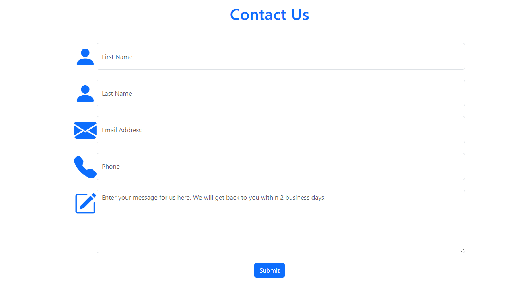

# Proyecto de Desarrollo Web

Este repositorio contiene varios archivos HTML para diferentes páginas web relacionadas con un proyecto de desarrollo web. El proyecto incluye un formulario de inicio de sesión, una página de contacto, una página de inicio con un menú de navegación y una página de gestión de usuarios.

## Formulario de Inicio de Sesión

### Descripción:
El formulario de inicio de sesión es una página de autenticación simple construida con Bootstrap. Permite a los usuarios iniciar sesión con su nombre de usuario y contraseña. El formulario también proporciona opciones para iniciar sesión utilizando cuentas de redes sociales.

### Vista previa:

## Página de Contacto

### Descripción:
La página de contacto es un formulario donde los usuarios pueden enviar sus consultas o mensajes a los administradores del sitio web. Incluye campos para ingresar el nombre, apellido, dirección de correo electrónico, número de teléfono y un mensaje.

### Vista previa:

## Página de Inicio

### Descripción:
La página de inicio es la principal página de aterrizaje del sitio web. Incluye un menú de navegación adaptable, una sección de encabezado con información de contacto y varias secciones para mostrar diferentes servicios ofrecidos por el sitio web.

### Vista previa:

## Página de Gestión de Usuarios

### Descripción:
La página de gestión de usuarios está diseñada para mostrar una lista de usuarios en formato de tabla. Incluye opciones de búsqueda, filtrado y paginación. Los usuarios también pueden realizar acciones como ver los detalles del usuario, editar la información del usuario y eliminar usuarios.

### Vista previa:

## Calculadora

### Descripción:
La calculadora con jQuery es una aplicación web que permite realizar operaciones aritméticas básicas como suma, resta, multiplicación y división. Está construida utilizando tecnologías web como HTML, CSS (utilizando Bootstrap para el diseño) y jQuery para la interactividad. La calculadora tiene un campo de entrada donde se muestra el resultado de las operaciones y botones numéricos y de operadores para ingresar los valores. Además, cuenta con un botón para borrar el contenido del campo de entrada y otro para calcular el resultado de la operación. Es una herramienta simple y útil para realizar cálculos rápidos en el navegador web.

### Vista previa:

## Cómo utilizar:

1. Clona el repositorio en tu máquina local.
2. Abre los archivos HTML en un navegador web para previsualizar las páginas web.

## Tecnologías Utilizadas:

- HTML
- Bootstrap CSS
- Bootstrap Icons

## Licencia:

Este proyecto está bajo la Licencia MIT.
